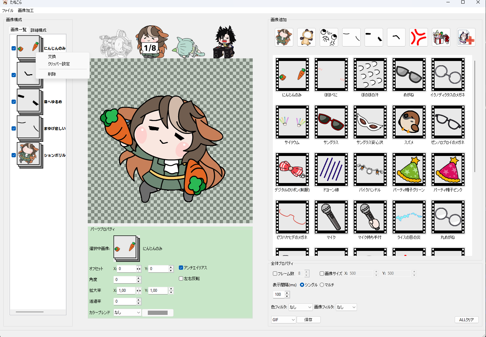
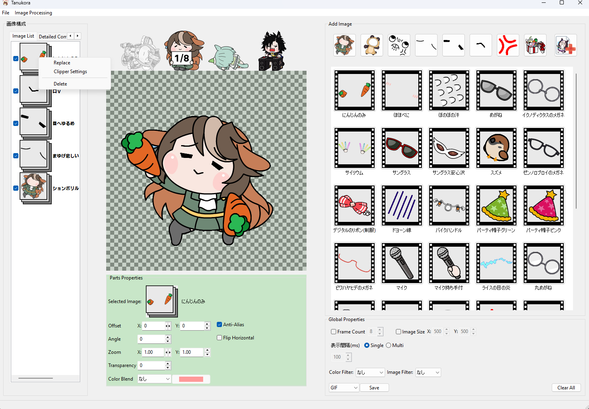

# たぬこら (Tanukora) — Instant Tanuki Maker

This is a fork of the original Japanese 「たぬこら」 project with added English UI localization.

## Screenshots

| Original (Japanese) | Patched (English) |
|:---|:---|
|  |  |

## Requirements

- Windows 10 or later (required for `pywin32` and DPI features)
- Python 3.9+
- The original `Data/` asset folder (not included in this repo)

## Setup

1. Install dependencies:
   ```bash
   pip install -r requirements.txt
   ```

2. Obtain the `Data/` assets:
   - Download the original release ZIP from the upstream repository.
   - Extract the `Data/` folder into the root of this project.

3. Run from source:
   ```bash
   python main.py
   ```

## Building the .exe

The easiest way is the provided `build.bat`:

```batch
build.bat
```

Or manually:

```bash
pip install -r requirements.txt
pyinstaller tanukora.spec
```

The resulting `.exe` will be in the `dist/` folder.

## Localization

UI text is now wrapped with a simple JSON-based i18n system. English strings live in `locale/en.json`. If a translation key is missing, the original Japanese text is shown as a fallback.

To add a new language, copy `locale/en.json` to e.g. `locale/fr.json`, translate the values, and change the `lang` parameter in `i18n.py`.

## Notes

- This codebase targets Windows and uses `pywin32` / `ctypes.windll` calls.
- The `Data/` folder is required; the app will not start without it.
